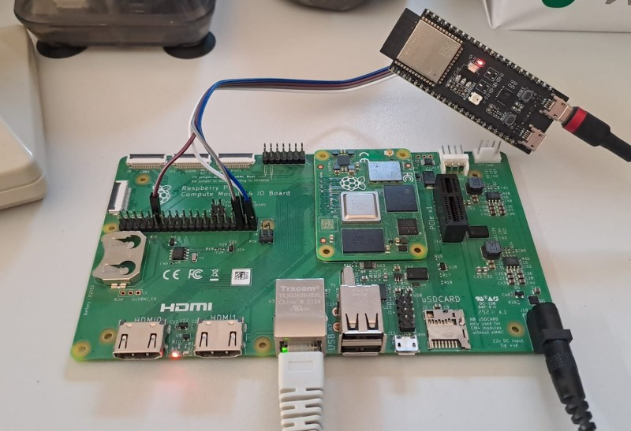

# Raspberry Pi I2S experiment

This repository contains the source code of a little experiment, performed to check Broadcomm I2S receiver behavior details. The whole experiment was performed as part of my efforts to solve ReSpeaker 4-Mic Array random channel ordering issue. To get more context, see [seeed-voicecard#309 ](https://github.com/respeaker/seeed-voicecard/issues/309)issue.





Experiment involves:

* [rx](rx) side - I2S receiver (C code) that prints out received samples (32 bit hex values) to `stdout`.
* [tx](tx) side - simple Circuit Python script running on `ESP32-S3-DevKitC- 1-N8` which emulates I2S transmitter using regular GPIO bit-banging (no need for accurate timing).


The I2S settings on both sides follow what ReSpeaker 4-Mic Array driver would use (see the issue linked above), namely:

* transmitter uses 128 bit frames, with four 32-bit slots. 
  * each frame contains 4 samples of the following format:
    * bits `31..28` - `0xAA` marker
    * bits `27..4` - frame counter
    * bits `3..0` - slot number

* receiver is configured for 64-bit frames (effectively resynchronizing to `LRCK` every second 64-bit frame).


To perform the test:

* connect ESP32 to Pi (**TODO**: describe pinout)
* restart ESP32 with `tx` script uploaded, it will start sending frames immediately, printing the frame index to console
* start `rx` program on Pi


Transmitter script sends 1000 frames, but only generates `LRCK` pulses starting from frame #500. This allows for checking how the I2S receiver would behave before codec's `LRCK` clock is enabled. Unfortunately, it seems that the receiver synchronizes randomly and only regains sync on the first `LRCK`. It is clearly visible in the `rx` output, that I2S decoder synchronizes at random place, and only regains proper sync from frame #500.

```
Starting...
RX loop
0x00ac02aa
0x00ac03aa
0x00ac04aa
...
0x01f501aa
0x01f502aa
0x01f503aa 
0xaa01f601 <-- first properly synchronized value
0xaa01f602
0xaa01f603
0xaa01f604
```

